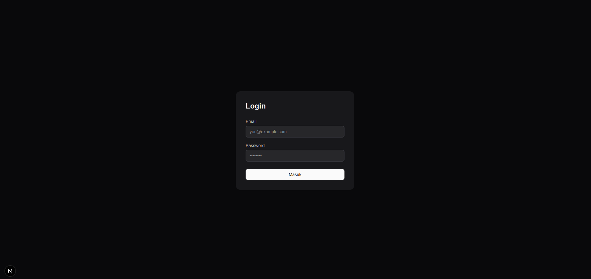
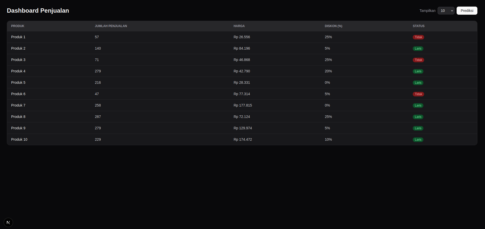
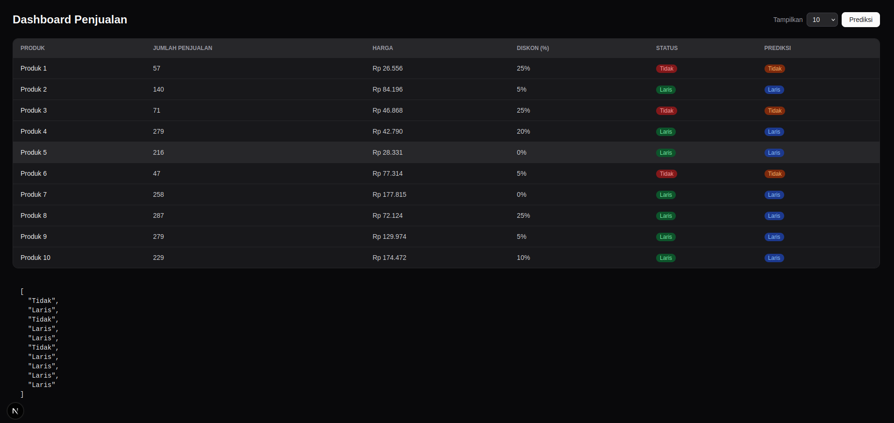
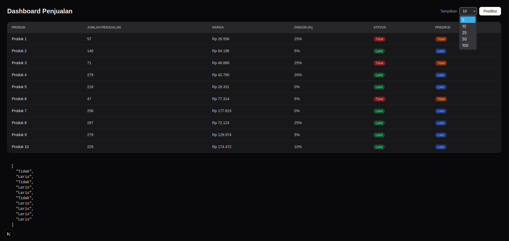
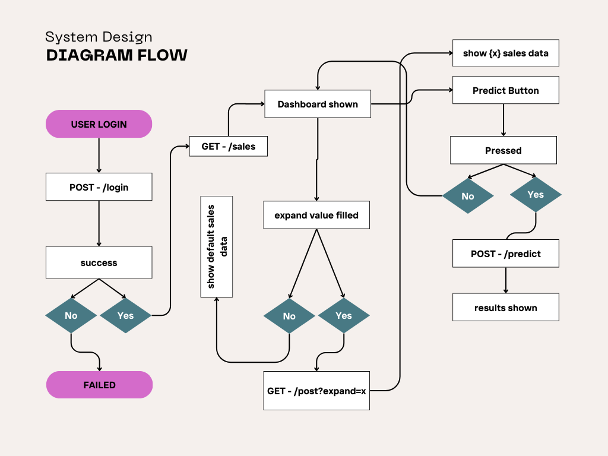

# Technical test

## Table of Contents
- [Screenshots](#screenshots)
- [How to run](#how-to-run)
- [Backend](#backend)
- [Frontend](#frontend)
- [System Design](#system-design)
- [Design Decisions](#design-decisions)
  - [Frontend](#frontend-1)
  - [Backend](#backend-1)
  - [Machine Learning](#machine-learning)
- [Asumsi yang Digunakan](#asumsi-yang-digunakan)

## Screenshots

<table>
  <tr>
    <td></td>
    <td></td>
  </tr>
  <tr>
    <td></td>
    <td></td>
  </tr>
</table>

## How to run
```
dummy account

email: test@example.com
password: password
```

### Setup venv

```bash
# Buat venv
python -m venv venv

# Linux / macOS
source venv/bin/activate

# fish
source venv/bin/activate.fish

# Windows
venv\Scripts\activate
```

## Backend

```bash
# Install dependencies (dari root project)
pip install -e .
pip install -r requirements.txt

# Jalankan server
cd backend
uvicorn main:app --reload
```

Server berjalan di `http://localhost:8000`

---

## Frontend

```bash
cd frontend
npm install
npm run dev
```

App berjalan di `http://localhost:3000`

## System Design

[Download pdf](assets/pdf/system_design.pdf)
## Design Decisions

### Frontend
Pengunaan Next.JS untuk framework fe adalah pilihan yang tepat dikarenakan fleksibilitasnya untuk pembuatan website secara cepat dan full fitur.
#### FE: Design pattern
Hanya ada tabel dengan width full dari kiri ke kanan, dengan fitur pemilihan size `expand`: `5`, `10`, `25`, `50`, `100`. dan tombol `Prediksi` untuk effisiensi website memuat konten

### Backend
Backend menggunakan FastAPI, dengan route:
- `POST`: /login
- `GET`: /sales
- `POST`: /predict
- `GET`: /
- `GET`: /health
- `DOCS`: /docs
#### BE: Structure tree

```
backend/
├── main.py
├── .env
├── requirements.txt
└── app/
    ├── core/
    │   └── config.py
    ├── routers/
    │   ├── login.py
    │   ├── sales.py
    │   └── predict.py
    ├── schemas/
    │   ├── user.py
    │   └── sales.py
    └── utils/
        ├── jwt.py
        └── validate_user.py
```

### Machine Learning
Model dari Ml menggunakan `Logistic Regression` dikarenakan pertimbangan dari skala dari data ini, dan dataset penjualan bersifat klasifikasi biner (`Laris`/ `Tidak Laris`)

---

## Asumsi yang Digunakan

- **Dummy user** - autentikasi menggunakan satu user statis dari `.env` (`DUMMY_ADMIN` & `DUMMY_PASSWORD`), tanpa database

- **Data statis** - data penjualan dibaca langsung dari `data/sales_data.csv`, tidak ada mekanisme upload atau update data

- **Model sudah dilatih** - `model.pkl` diasumsikan sudah ada sebelum endpoint `/predict` dipanggil; training dilakukan terpisah via `ml/utils/train.py`

- **Fitur prediksi tetap** - model hanya menggunakan tiga fitur: `jumlah_penjualan`, `harga`, dan `diskon`

- **Label status biner** - kolom `status` pada dataset hanya memiliki dua nilai: `Laris` dan `Tidak Laris`

- **Single user session** - tidak ada manajemen multi-session; satu cookie token per browser

- **CORS hanya localhost** - `ALLOWED_ORIGINS` hanya mengizinkan `http://localhost:3000` sesuai kebutuhan development

### Reproduce model ML
```bash
python -m pytest workdir/ml/tests/test_train.py -v
```